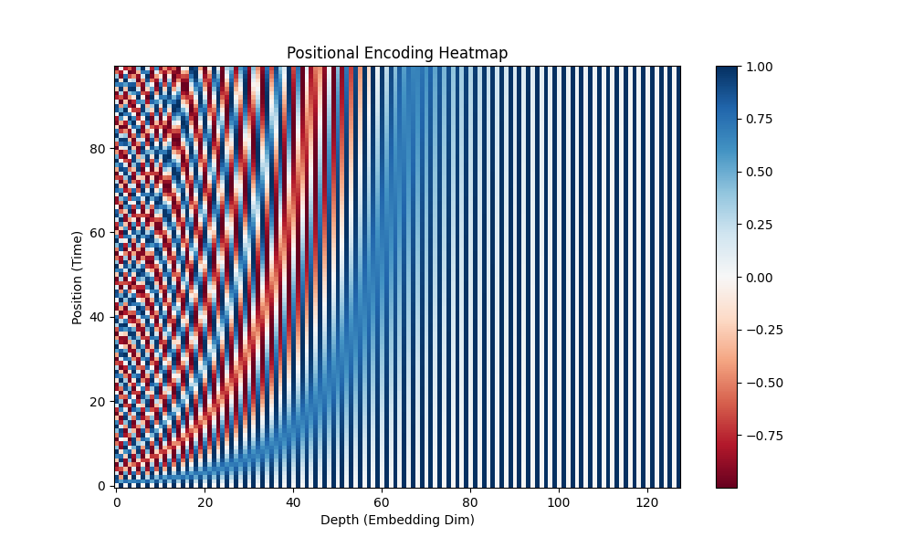
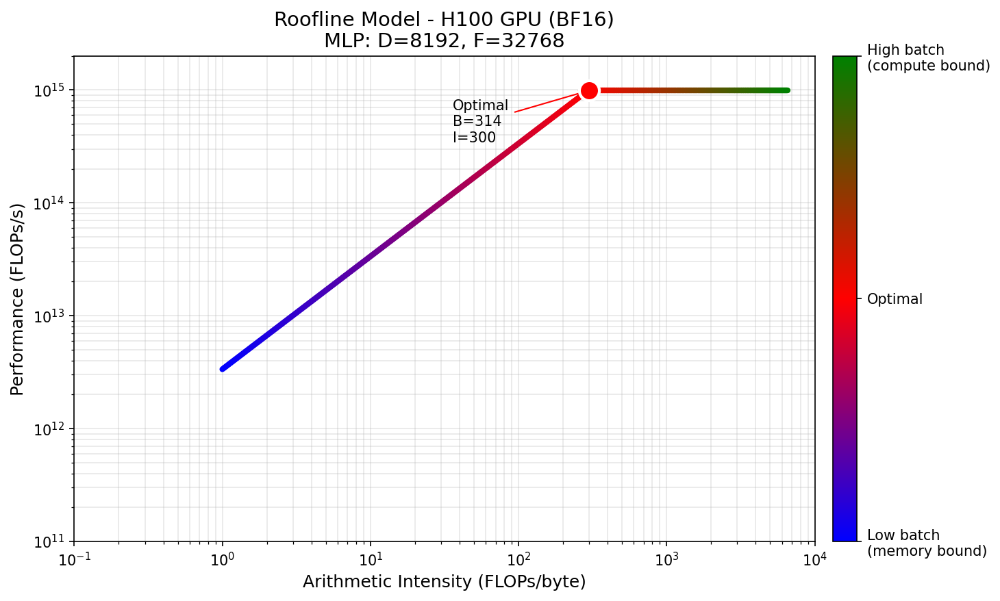
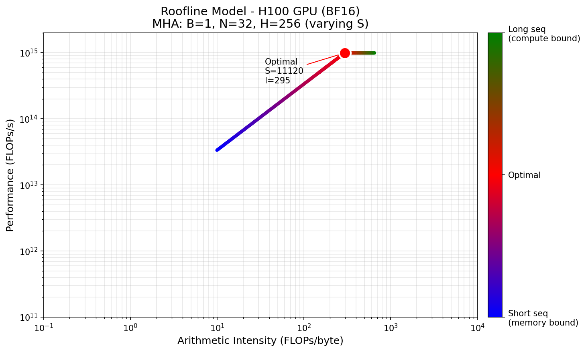

# Machine Learning

Here are the modern implementations of LLM architecture, sharding strategies and kernel optimizations.

## Core

- Softmax in [PyTorch with autograd](core/torch/softmax.py) and in [NumPy](core/numpy/softmax.py)
- Linear projection in [PyTorch with autograd](core/torch/linear.py)
- Multi Layer Perceptron in [PyTorch with autograd](core/torch/mlp.py)

## Transformer Architecture

- Disaggregated Serving with KV Cache in [PyTorch](core/torch/attention.py)
- Multihead Attention in [PyTorch with autograd](core/torch/attention.py)
- Norm RMS in [PyTorch with autograd](core/torch/normalization_rms.py) and in [NumPy](core/numpy/normalization_rms.py)
- Transformer in [PyTorch with autograd](core/torch/transformer.py)

#### Positional Encoder

- Positional Encoder Sinusoidal in [NumPy](core/numpy/positional_encoding_sinusoidal.py)
- RoPE in [NumPy](core/numpy/positional_encoding_rope.py)
- RoPE GPT-NeoX in [NumPy](core/numpy/positional_encoding_rope_neox.py)

📊 Positional Encoding Visualizations

| Sinusoidal | RoPE | RoPE GPT-NeoX |
|:---:|:---:|:---:|
|  |  |  |

## Sharding strategies

- MLP Data Parallelism(DP) in [PyTorch](core/torch/sharding/mlp_dp.py), in [JAX](core/jax/sharding/mlp_dp.py)
- MLP Tensor Parallelism(TP) in [PyTorch](core/torch/sharding/mlp_tp.py), in [JAX](core/jax/sharding/mlp_tp.py)
- MLP Fully Sharded Data Parallelism(FSDP) in [PyTorch](core/torch/sharding/mlp_fsdp.py), in [JAX](core/jax/sharding/mlp_fsdp.py)
- MLP Pipelining in [PyTorch](core/torch/sharding/mlp_pp.py)

## Scaling plots

The following are roofline analysis for different architectures. Those are non-fused operations.

- MLP roofline analysis in [NumyPy](core/numpy/roofline_plot_mlp.py)
- Multi-Head Attention roofline analysis in [NumyPy](core/numpy/roofline_plot_mha.py)

📊 Roofline Plots

| MLP | Attention |
|:---:|:---:|
|  |  |

## NumPy Tutorial

- Masking in [NumPy](core/numpy/masking.py)

## JAX Tutorial

- [JIT](core/jax/jit.py)
- [Condition](core/jax/condition.py)
- [Shading and Mesh](core/jax/sharding.py)

## PyTorch Notes

- [Torch distributed API](https://docs.pytorch.org/docs/stable/distributed.html).
- don't use the old primitives, instead use in-place ones like `dist.all_gather_into_tensor` and `dist.all_reduce_tensor` that aggregate along the primary dimension.
- custom classes for training requires `torch.autograd.Function`, `@staticmethod` and [`ctx.save_for_backward`](https://docs.pytorch.org/docs/stable/generated/torch.autograd.function.FunctionCtx.save_for_backward.html)